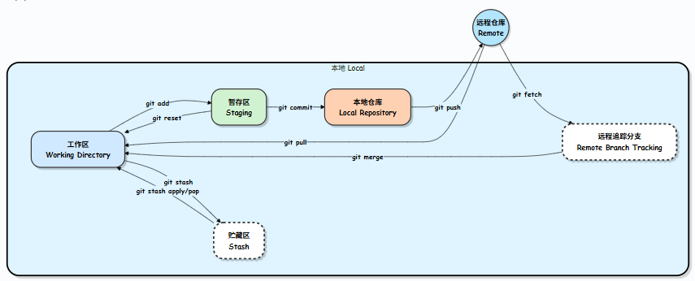
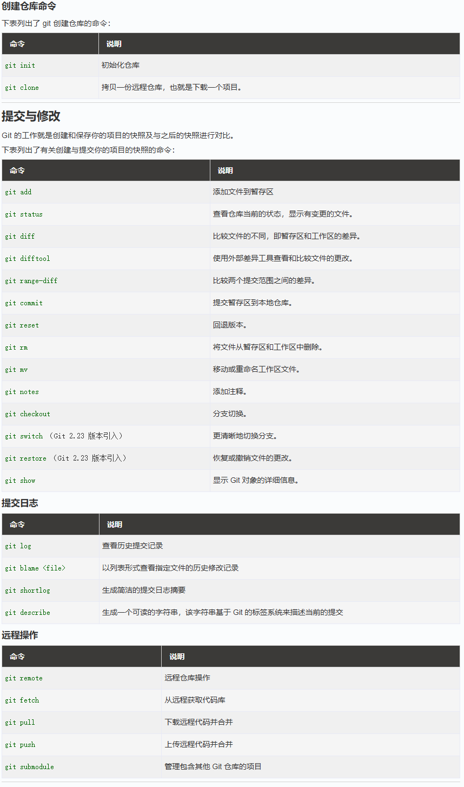

# Git Learning Notes

[TOC]

## 配置

`git config` 用来配置或读取相应的工作环境变量，这些变量可以存放在以下三个不同的地方：

* Git/etc/gitconfig 文件：系统中对所有用户都普遍适用的配置，若使用 git config 时用 --system 选项，读写的就是这个文件
* ~/.gitconfig 文件：用户目录下的配置文件只适用于该用户，若使用 git config 时用 --global 选项，读写的就是这个文件
* 当前项目的 Git 目录中的配置文件（也就是工作目录中的 .git/config 文件）

### 配置用户信息

配置个人的**用户名称**和**电子邮件地址**，这是为了在每次提交代码时记录提交者的信息：

```bash {.line-numbers}
    git config --global user.name "runoob"
    git config --global user.email test@runoob.com
```

***Remark***: 如果用了 --global 选项，那么更改的配置文件就是位于你用户主目录下的那个，以后你所有的项目都会默认使用这里配置的用户信息；如果要在某个特定的项目中使用其他名字或者电邮，只要去掉 --global 选项重新配置即可，新的设定保存在当前项目的 .git/config 文件里

### 查看配置信息

`git config --list` 检查已有的配置信息，空格实现翻页，q退出查看

### 生成SSH密钥

如果你需要通过 SSH 进行 Git 操作，可以生成 SSH 密钥并添加到你的 Git 托管服务（如 GitHub、GitLab 等）上
***Remark***: SSH 用于安全地连接到 Git 托管服务，无需每次都输入用户名和密码

## Git 工作流程

<div align="center">
    
</div>

知识点说明：

* **git stash**：暂存目前修改的代码
* **git pull**：从远程仓库拉取最新的代码到本地，确保本地代码是最新的
* **git fetch and merge**：从远程仓库获取最新的代码并合并到当前分支

***Remark 1***: git stash 可以让你在不提交当前修改的情况下切换分支或拉取最新代码，避免了冲突和不必要的提交

***Remark 2***: git pull 和 git fetch and merge 的主要区别在于，git pull 会自动将远程代码合并到当前分支，而 git fetch and merge 需要你手动执行合并操作

***Remark 3***: origin 是远程仓库的默认代号，当你在电脑上通过 git clone 下载代码，或者关联一个 GitHub 仓库时，Git 默认会把那个云端仓库命名为 origin

## Git 工作区、暂存区和版本库

* **工作区（Working Directory）**：是你在本地计算机上的项目目录，你在这里进行文件的创建、修改和删除操作
* **暂存区（Staging Area）**：是一个临时存储区域，它包含了即将被提交到版本库中的文件快照，在提交之前，你可以选择性地将工作区中的修改添加到暂存区，一般存放在 .git 目录下的 index 文件
* **版本库（Repository）**：版本库包含项目的所有版本历史记录，为隐藏目录 .git

## Git 基本操作

<div align="center">
    
</div>

## 比较更改

`git diff`的输出：

```bash {.line-numbers}
    diff --git a/config.txt b/config.txt
    index e69de29..fb8f733 100644
    --- a/config.txt
    +++ b/config.txt
    @@ -1,0 +1,2 @@
    +verbose = true
    +theme = dark
```

其中，各行输出含义如下：

1. `a/` 代表源文件（旧版本），`b/` 代表目标文件（新版本）
2. `index e69de29..fb8f733 100644` 提供 Git 内部使用的元数据
3. `--- a/config.txt` 和 `+++ b/config.txt` 分别表示源文件和目标文件的路径
4. `@@ -1,0 +1,2 @@`: 这是“块头”（hunk header）。它总结了文件中特定块（或“hunk”）内的更改
   * `-1,0` 表示更改从 `a/` 版本（源文件）的第 1 行开始，该块涵盖源文件中的 0 行（因为它为空）
   * `+1,2` 表示更改从 `b/` 版本（目标文件）的第 1 行开始，该块包含目标文件中的 2 行
   * 有时你会看到周围未更改的行被包含进来，以便提供上下文
5. 以 + 开头的行：这些行已在 `b/` 版本（较新状态）中添加
6. 以 - 开头的行：这些行存在于 `a/` 版本中，但在 `b/` 版本中已被移除
7. 以空格开头的行：这些行未更改，并为实际的修改提供了上下文

* `git diff`：显示工作区和暂存区之间的差异，显示未暂存的更改
* `git diff --staged`：显示暂存区和版本库之间的差异，显示已暂存但未提交的更改
* `git diff <提交>`：显示指定提交与当前工作区之间的差异
* `git diff <提交1> <提交2>`：比较两个提交之间的差异，其中提交可以使用SHA-1哈希值、分支名称、标签名称或短散列（HEAD~1, HEAD~2等）来指定